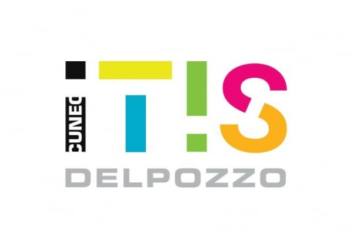

# Compiti Python TPSIT

Benvenuto nella repository dedicata ai compiti di Python per l'anno scolastico di **TPSIT** (Tecnologie e Progettazione di Sistemi Informatici e di Telecomunicazioni).

## Struttura della repository

Ogni cartella conterrà i compiti suddivisi per assegnazione. Seguirà una struttura simile:
├── Esercizixx-xx-xx │ └── es_x.py 

## Aggiornamenti

La repository verrà aggiornata settimanalmente entro la sera prima dalla data di consegna su classroom. (i tempi potrebbero dilungarsi in periodi molto faticosi)

## Contatti

Per ogni domanda aprire una richiesta di issues o contattarmi direttamente sulla mail scolastica.

Torelli Luca Augusto.
